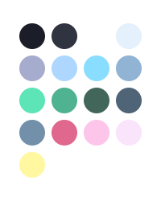

<p align="middle">
  
  
</p>

Poimandres is a minimal, frameless theme based on the [blueberry](https://github.com/peymanslh/vscode-blueberry-dark-theme) dark-theme.

The screencap above uses the following settings:

```json
{
  "workbench.colorTheme": "poimandres",
  "workbench.iconTheme": "quill-icons-minimal",
  "workbench.productIconTheme": "icons-carbon",
  "editor.renderIndentGuides": false,
  "editor.renderWhitespace": "none",
  "editor.minimap.renderCharacters": false,
  "editor.fontSize": 13.5,
  "editor.fontFamily": "Menlo",
  "window.zoomLevel": 0.5,
}
```